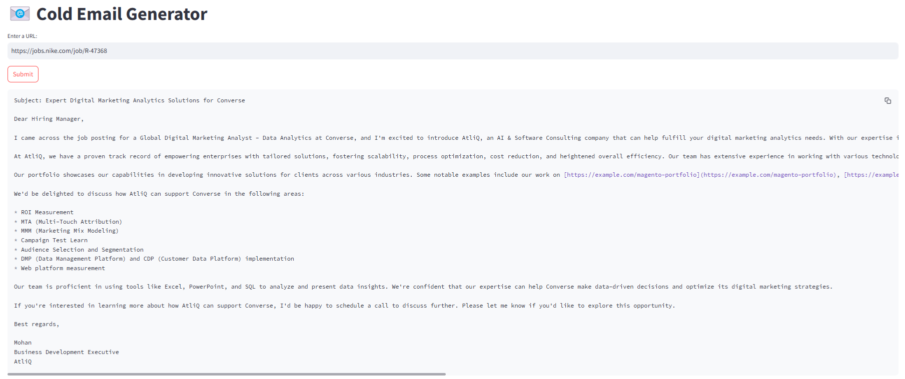
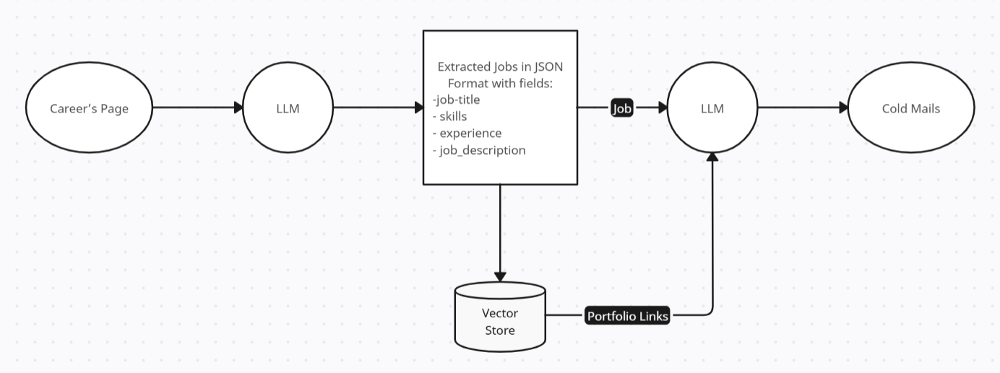

# 📧 Cold Email Generator

A cold email generator designed for service companies, built with Groq, LangChain, and Streamlit. This tool lets users provide the URL of a company's careers page, extracts job postings from the page, and creates customized cold emails. The emails incorporate relevant portfolio links retrieved from a vector database, tailored to match the specific job descriptions.

## Architecture Diagram
